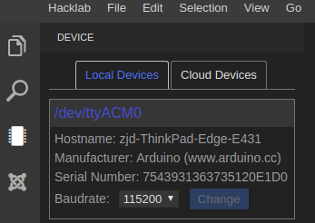

# Arduino-blink用例

## 简介
本例基于[阿里云设备开发工作台](https://hacklab.aliyun.com)和[TinyLink代码库](http://tinylink.emnets.org)， 实现Arduino Uno板载LED灯的闪烁。

## 准备工作
* 一个阿里云账号， 新用户可以在[阿里云](https://cn.aliyun.com)免费注册。
* 一台装有浏览器的开发PC，请使用Chrome浏览器。
* 一块Arduino Uno开发板，以及对应的USB开发板连接线。

## 本地硬件连接到云端
* 使用阿里云账号登录[阿里云设备开发工作台](https://hacklab.aliyun.com)
* 下载IDE Agent。点击设备开发工作台左下角“Download IDE Agent”按钮，下载IDE Agent。

* 解压下载得到的“device-agent-linux.zip”文件， 并运行。
    ```
    ./run-linux.sh
    ```
* 将Arduino Uno开发板通过USB连接线连接到PC上，设备管理列表可以看见设备上线。


关于Device Agent的详细介绍参考[阿里云设备开发工作台用户指南](https://gaic.alicdn.com/doc/hacklab/duaucu.html)

## 创建工程和代码
* 在设备开发工作台界面点击“File->Create Project”， 创建工程。工程配置如下。
    * Name: tinylink_blink
    * Board: Arduino Uno
    * Framework: Arduino


* 右键点击“src->New File”， 新建tl_blink.ino文件。

* 双击打开tl_blink.ino, 输入代码段。在本示例中，我们用到了3个TinyLink接口，分别是"TL_Serial"、"TL_LED"、"TL_Time"。关于上述接口的详细介绍请参考[TinyLink API文档](http://tinylink.emnets.org/view/en/api_page.php)


* 修改配置文件platformio.ini, 添加库文件依赖， 定义设备类型及设备接口。在本示例中，我们依赖的库文件为“TinyLink_Library_Arduino”。我们用到了3个TinyLink库提供的接口，分别是TL_LED、TL_Serial以及TL_Time。由于这三个接口无需外接设备， 因此三个接口均定义为开发板ID。关于build_flag的配置请参考[TinyLink库文件介绍](https://github.com/TinyLink/TinyLink_Library_Arduino)


## 编译和烧写
* 编译和烧写按钮位于IDE底部


* 点击“编译”， Terminal显示编译成功


* 点击"运行"， Terminal显示烧写成功


## 用例展示
程序烧写完毕后，可以看到Arduino Uno开发板上的LED灯周期闪烁


# Arduino 温湿度采集用例

## 简介
本例基于[阿里云设备开发工作台](https://hacklab.aliyun.com)和[TinyLink代码库](http://tinylink.emnets.org)， 实现基于Arduino Uno开发板的温湿度采集应用。

## 准备工作
* 一个阿里云账号， 新用户可以在[阿里云](https://cn.aliyun.com)免费注册。
* 一台装有浏览器的开发PC，请使用Chrome浏览器。
* 一块Arduino Uno开发板、USB开发板连接线、Base Sheild扩展板、DHT11温湿度传感器。

## 本地硬件连接到云端
同上

## 创建工程和代码
* 工程的创建参考上一示例

* 编写代码，利用DHT11温湿度传感器，周期采集室内温湿度。在本示例代码中，我们用到了4个TinyLink库提供的接口，分别是"TL_Serial"、"TL_Temperature"、"TL_Humidity"、"TL_Time", 关于上述接口的详细信息请参考[TinyLink API文档](http://tinylink.emnets.org/view/en/api_page.php)


* 修改配置文件platformio.ini, 添加库文件依赖， 定义设备类型及设备接口。在本示例中，我们依赖的库文件为“TinyLink_Library_Arduino”。在本示例中，"TL_Serial"和"TL_Time"均使用开发板内置的功能，其ID定义为开发板ID。"TL_Temperature"和"TL_Humidity"接口均使用DHT11温湿度传感器，根据[TinyLink库文件介绍](https://github.com/TinyLink/TinyLink_Library_Arduino)， 查找表格，可知我们需要定义TINYLINK_TEMPERATURE=3032， TINYLINK_HUMIDITY=3032。另外，根据上述参考表格，我们定义数据引脚TEMPERATURE_DIGITAL_OUTPUT以及HUMIDITY_DIGITAL_OUTPUT为2号引脚。


## 编译和烧写
同上

## 用例展示
打开Device View，并点击蓝色的设备串口名打开串口日志Terminal，可以在该Terminal中看到Log输出信息


# Arduino 上报温度数据至阿里云物联网平台

## 简介
本例基于[阿里云设备开发工作台](https://hacklab.aliyun.com)、[TinyLink代码库](http://tinylink.emnets.org)以及[阿里云物联网平台](https://iot.console.aliyun.com)， 将设备端采集到的温度数据上报至阿里云物联网平台。

## 准备工作
* 一个阿里云账号， 新用户可以在[阿里云](https://cn.aliyun.com)免费注册。
* 一台装有浏览器的开发PC，请使用Chrome浏览器。
* 一块Arduino Uno开发板、USB开发板连接线、Base Sheild扩展板、DHT11温湿度传感器、Grove Esp8266 WiFi模块。

## 本地硬件连接到云端
同上

## 在阿里云物联网平台创建产品和设备
* 登录[阿里云物联网平台](https://iot.console.aliyun.com)

* 创建产品。点击左侧“设备管理”->“产品”菜单， 点击“创建产品”


* 设置产品信息。设置产品名称、联网方式等信息


* 添加产品功能。选择我们创建的产品，点击“功能定义”选项， 添加自定义功能。在本示例中，我们为产品添加一个“温度”属性， 标识符为“temp”， 类型为“float”类型


* 添加设备。点击左侧“设备管理”->“设备”菜单， 点击“添加设备”


* 配置设备信息。选择我们刚刚创建的产品，配置设备名称


* 设备创建完成，在设备信息界面可以看到设备的相关信息


## 创建工程和代码
* 工程的创建参考上一示例

* 编写代码，利用DHT11温湿度传感器，周期采集室内温度数据并上传至阿里云物联网平台。代码可参考https://github.com/TinyLink/TinyLink_Library_Arduino/blob/master/examples/tl_mqtt.cpp
（注：示例代码中的WiFi信息以及MQTT参数信息需要开发者根据设备三元组（ProductKey、DeviceName、DeviceSecret）自行填写， 其中，MQTT_PASSWORD参数请使用[该网页](http://tool.oschina.net/encrypt?type=2)计算。
明文： clientId[DEVICE_NAME]deviceName[DEVICE_NAME]productKey[PRODUCT_KEY]timestamp[TIMESTAMP]
加密方式： HmacSHA256
密钥：[DEVICE_SECRET]
）

* 修改配置文件platformio.ini, 添加库文件依赖， 定义设备类型及设备接口。在本示例中，我们依赖的库文件有两个，分别是“TinyLink_Library_Arduino”以及“AliyunMqttArduino”。“TinyLink_Library_Arduino”库文件主要用于采集温度数据，此部分相关代码及配置请参考上一示例。“AliyunMqttArduino”库用于将采集到的数据通过MQTT协议上传至阿里云物联网平台，该库的相关介绍参见https://platformio.org/lib/show/6100/AliyunMqttArduino


## 编译和烧写
同上

## 用例展示
在阿里云物联网平台查看设备运行状态，可以看到设备上传的温度数据。


